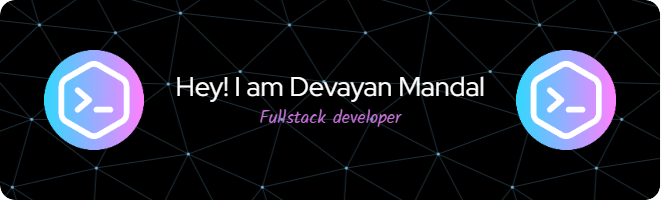

  

<h1 align="center">Heyyy 👋, I'm Devayan Mandal!</h1>
<h3 align="center">
  Full Stack Developer | Blockchain Enthusiast | AI/ML | CyberSecurity | Open Source Contributor
</h3>

  🚀 Passionate about creating impactful digital solutions and exploring the frontiers of technology.

  🌟 Currently diving deep into <strong>Full Stack Development</strong> and exploring the transformative potential of <strong>Blockchain</strong>, <strong>AI/ML</strong>, and <strong>Cybersecurity</strong>.

  📚 Actively learning and contributing to the world of <strong>Open Source</strong> while staying on top of the latest tech trends and innovations.

  
  
  
  
  
  
  
  

  
  
  

---

## 🌟 About Me
I'm a passionate developer with a love for creating impactful web applications. Currently, I'm diving deep into Full Stack Web Development and Blockchain technologies.

- 🔭 **Currently Working On**: [Solio.io](https://github.com/devayanm/solio.io) - An innovative college app that integrates social media and academic functionalities to enhance the student experience. Includes features like an alumnus connect button, anonymous feedback system, and more.
- 🌱 **Learning**: Advanced concepts in blockchain development, particularly focusing on smart contracts and decentralized finance (DeFi).
- 💬 **Ask Me About**: Web Development, AI/ML, CyberSecurity, Blockchain, Smart Contracts, and Decentralized Applications (DApps).
- ⚡ **Fun Fact**: I believe in the power of code to change the world and enjoy solving complex problems with simple, elegant solutions.

---

## 🛠️ Tech Stack

### Programming Languages

  
  
  
  
  

### Frameworks & Libraries

  
  
  
  
  
  
  
  

### Tools & Platforms

  
  
  
  
  
  
  
  
  
  
  
  
  
  

---

## 🚀 Projects
### [Solio.io](https://github.com/devayanm/solio.io)
A comprehensive college app designed to streamline communication and resources for students. Features include:
- Social media integration
- Anonymous feedback and complaint system
- Academic tools like attendance reports and class schedules

### [AssetHub](https://github.com/devayanm/assethub)
A blockchain-based DApp for asset management. Features include:
- Asset registration and verification
- Marketplace for buying, selling, and renting assets
- Auction and bidding functionalities

### [Pramaanpatra](https://github.com/devayanm/pramaanpatra)
A digital certificate management system aimed at simplifying the verification and storage of certificates. Key features:
- Secure storage and retrieval of digital certificates
- Easy sharing with institutions and employers
- Blockchain-based verification

### [MyPortfolio](https://github.com/devayanm/Portfolio)
A personal portfolio showcasing my projects, skills, and achievements. Features include:
- Interactive project showcase
- Responsive design
- Blog integration

### [More Projects](https://github.com/devayanm?tab=repositories)
Explore more of my projects on GitHub!

---

## 📈 GitHub Stats

  
  
  

## 🏆 GitHub Trophies

  

## ✍️ Random Dev Quote

  

---

## 🎓 Education
- **Bachelor of Technology in Information Technology**
  - JIS College of Engineering (2021-2025)
  - Relevant Coursework: Data Structures, Algorithms, Database Systems, Web Development, Blockchain Technology

---

## 🌟 Interests
- **Blockchain Technology**: Passionate about decentralized systems and the future of Web3.
- **Artificial Intelligence**: Exploring AI's potential to revolutionize various industries.
- **Open Source Contribution**: Actively contributing to open-source projects and communities.
- **Photography**: Capturing moments and landscapes in my free time.

---

## 🔗 Links
- [Portfolio Website](https://devayan.netlify.app/)
- [GitHub](https://github.com/devayanm)
- [LinkedIn](https://www.linkedin.com/in/devayan-mandal/)
- [Blog](https://devayanm.hashnode.dev/)

---

*Let's build the future, one line of code at a time.* 🚀
